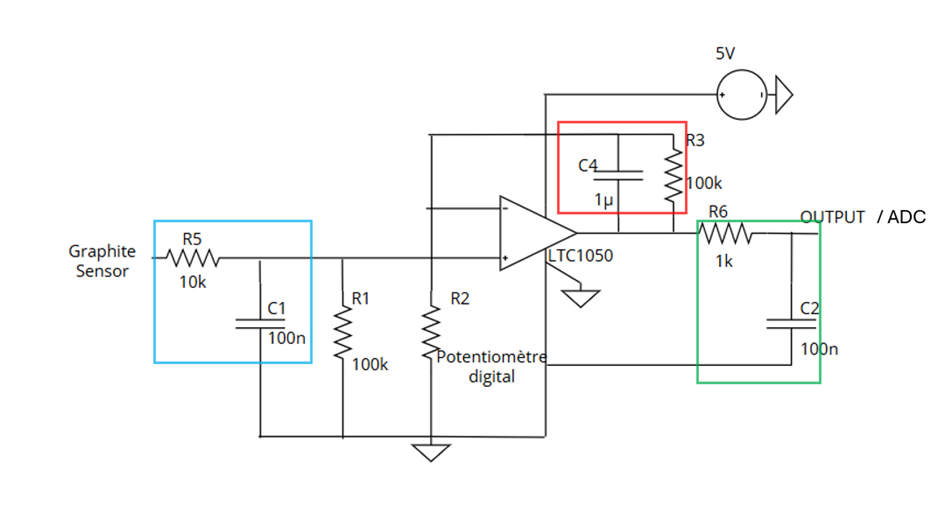
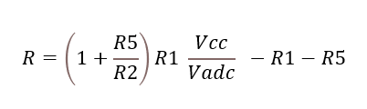

# 2024-2025-4GP-GregoryBibiloni-GuillaumeBarth

## Projet Capteur Graphite

# Sommaire

- [Contexte](#contexte)
- [Livrables](#livrables)
- [Matériel necéssaire](#matériel-nécessaire)
- [Simulation LTSpice](#simulation-ltspice)
- [Design du PCB via KiCad](#design-du-pcb-via-kicad)
- [Réalisation du Shield](#réalisation-du-shield)
- [Code Arduino](#code-arduino)
- [Application mobile Android via MIT App Inventor](#application-mobile-android-via-mit-app-inventor)
- [Banc de test](#banc-de-test)
- [Résultats](#résultats)
- [Datasheet du capteur graphite](#datasheet-du-capteur-graphite)
- [Conclusion](#conclusion)

---

# Contexte

Ce projet est réalisé dans le cadre de l’UF « du capteur au banc de test » pour les étudiants en quatrième année Génie Physique. Nous nous sommes inspirées de l’article scientifique Pencil Drawn Strain Gauges and Chemiresistors on Paper (Cheng-Wei Lin, Zhibo Zhao, Jaemyung Kim & Jiaxing Huang). Cet article explique comment faire un capteur résistif à partir de crayon et de papier.
Quand on écrit avec un crayon gris sur du papier, on dépose des couches de graphites qui sont des conducteurs et laisse passer le courant mais avec une résistance. En déformant ce papier, les chaines de graphique sont plus ou moins éloignés et le courant circule plus ou moins facilement ce qui implique une variation de résistance. Ce phénomène fait qu’on peut faire de ce capteur une jauge de contrainte.
L’objectif de ce projet est donc de pouvoir réaliser une jauge de contrainte « low-tech » 

---

# Livrables

Voici la liste des livrables :

•	Le Shield PCB branché sur une carte Arduino UNO, intégrant le capteur graphite, un module Bluetooth, un encodeur rotatoire, un potentiomètre numérique, un écran OLED, et un capteur de flexion industriel.
•	Le code Arduino qui permet de contrôler tous les composants et d’acquérir les mesures. (Mesure de résistance, Connection Bluetooth, Affichage de l’OLED, l’encodeur rotatoire et le potentiomètre numérique)
•	L’application Android qui permet d’afficher la valeur de la résistance directement sur son téléphone.
•	La datasheet du capteur en graphite (avec différentes valeurs de crayon)

---

# Matériel nécessaire

Pour concevoir notre dispositif, on a besoin de ces composants :
•	Des résistances : 1 résistance de 1 kΩ, 1 résistance de 10 kΩ, 2 résistances de 100 kΩ, une résistance R2 qui correspond au potentiomètre numérique (le MCP41050) et une résistance de 47 kΩ pour la jauge de contrainte industrielle
•	Des capacités : 2 capacités de 100 nF et 1 de 1 µF
•	D’un amplificateur opérationnel : le LTC1050
•	Un module Bluetooth HC-05
•	Un encodeur rotatoire ESP32
•	Un écran OLED 128 * 64
•	Un flex sensor
•	Le capteur graphite (connecté avec des pinces croco) fait avec un papier et un crayon
•	La carte Arduino UNO

---

# Simulation LTSpice

La résistance interne du capteur graphite est de l’ordre du GΩ donc le courant généré après application de la tension de 5V (Valeur de l’arduino) est faible (de l’ordre du nA). On a besoin de l’amplifier grâce à un montage transimpédance composé d’un amplificateur opérationel (AOP), le LTC1050, qui peut capter les signaux de faible intensité.

Ce montage est composé de 3 filtres afin de limiter le bruit :
•   En rouge, on filtre le 50 Hz du réseau d’électricité
•	En bleu, on filtre le bruit du capteur
•	En vert, on filtre le bruit de l’acquisition de l’Arduino

Pour calculer la valeur de la résistance du capteur graphite, la formule est la suivante :

Où R2 correspond à la valeur du potentiomètre numérique.

---

# Design du PCB

---

# Réalisation du Shield

---

# Code Arduino

---

# Application mobile Android via MIT App Inventor

---

# Banc de test

---

# Résultats

---

# Datasheet du capteur graphite

---

# Conclusion
